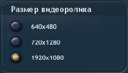

# RedGrox mini-mods

Это небольшие моды, созданные в основном чисто по приколу. Решил собрать их все вместе, потому что нет смысла создавать для каждого отдельные репозитории.

*Проекты для [SporeModder FX](https://github.com/emd4600/SporeModder-FX) находятся в папке `SMFX projects`.*

___

## Список модов

### DropCursorIcons

Убирает курсор поворота камеры. Полезно для съёмок видео про Spore, т. к. даже если в какой-любо программе для захвата экрана отключено отображение курсоров, этот курсор всё равно отображался.

### Моды, изменяющие текстуру телевизора

Это сразу несколько однотипных модов, которые изменяют текстуру телевизора в редакторе развлекательных центров. Вот список этих модов:

+ Arsik
+ Arsik & Barsik
+ Spore in Spore
+ YT Iaho

### Gif animations

Этот мод заменяет анимацию при генерации gif-изображений существ.
*Потом добавлю пример*

### Long Creature Stage

Удлиняет этап "Существо"

### Anonymous egg

Заменяет яйца существ, на яйцо анонимуса

### Eyeguy

Позволяет играть за вырезанную клетку Eyeguy.

### Prikol scenes

Добавляет новые анимации для горожан

### HD video

Улучшает качество видео, записанного в Spore. Качество зависит от настроек в игре

___

## Создатель

Мод сделал **RedGrox** (Дух Ияхо)

+ [Основной канал](https://www.youtube.com/c/ДухИяхо)
+ [Второй канал](https://www.youtube.com/c/КрутойДухИяхо2013)
+ [Телеграм](https://t.me/SporeRedGroxMods)
+ [spore.com](http://www.spore.com/view/myspore/RedGrox)
